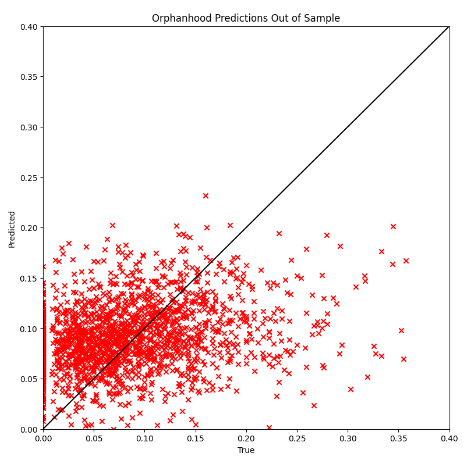
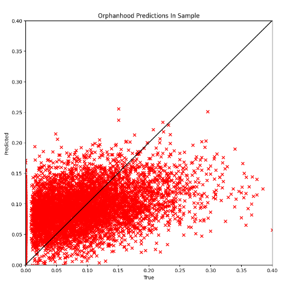

# KidSatExt
We have two aims with this extension of the KidSat project:
1. Use the DinoV2 model to predict orphanhood (as a proportion, and later as a count) in Zambia in 2018 and 2023. With the aim to compare this to data 
we have in the Sinazongwe District.
2. Review the code from the KidSat project and try to improve the structure and commenting.

If you are viewing this from the KidSat project, these are the main changes that I have made:
1. Changed the joins of the KR, IR and PR from ```survey_processing/main.py``` so that children from 6 to 18 are now included in the training data for the models. Restructured this code to make it is easier to understand and make changes to.
2. Tidied up, restructured and commented several files. As one example, I've commented and restructured ```evaluate_orphanhood.py```, which is the counterpart to ```evaluate.py``` from the KidSat project. This file only needs a couple of small changes to be used for predicting child deprivation for the KidSat project.
3. Added code to predict orphanhood given a collection of satellite images and center coordinates.
4. Added a more in-depth set of instructions for getting all the data, setting up the google cloud compute engine, training the model, getting predictions and orphanhood maps.

More detailed findings are found in the next subsection!

Here is an overall description of how we plan to predict orphanhood:
1. Get DHS data, use this to create our child deprivation indicators (we call poverty variables).
2. Aggregate DHS data, poverty variables to the cluster level and combine with GPS data.
3. Associate a satellite image with each cluster.
4. Finetune our DinoV2 model on the satellite imagery to predict the proportion of children who have lost a mother and the proportion of children who have lost a father, or this vector combined with the 99 dimension child deprivation vector from the KidSat project.
5. Then we add a ridge regression layer to our DinoV2 model that outputs one value, orphanhood. We fit this regression layer with the satellite imagery and orphanhood data.
6. Now we can freely evaluate our model on a grid of satellite imagery covering a whole country, say Zambia and display a chorolopleth map of orphanhood.

If you wish to move straight on to the setup instructions, skip this next section.

### My Findings and Suggestions for the KidSat Paper

1. Firstly in ```survey_processing/main.py``` I have changed the join of the PR and IR to the KR (under 5's dataset), from a left join to an outer join. As a consequence the data now includes 6 - 18 year olds. This means that there is a lot more data so the predictions from the KidSat paper could potentially be improved. Also, the 99 dimension vector from the KidSat paper mainly depends on data from the PR, and only a few variables from the KR. So these new 6 - 18 year olds will have enough data to contribute towards the 99 dimension vector.
2. In ```finetune.py``` and ```evaluate.py```, clusters that are missing any variable from the 99 dimension vector are removed. This means that the total number of clusters is reduced from 24,000 to 14,000. And it also means we lose 14 surveys from the 46 we had. Including all the pre-2005 surveys, ZA2017 (the only survey we're using in South Africa), RW2005, RW2008 and ET2010. It may be useful to look at either excluding these surveys from the paper, or looking at ways of including more of the data.
3. I have restructured, partially recoded and fully commented ```survey_processing/main.py``` to make it easier to make future changes.
4. I suggest outputting the MAPE, MSE, MAE and R2 score everytime the model is trained since MAE does not give a full picture, due to the data being in the range [0, 1].
5. The file ```download_imagery.py``` gives the option to get imagery with all colour bands or RBG only. The RGB bands from these images however need to be read differently from each other. I have adapted ```load_and_preprocess_image()``` in ```predict_orphanhood.py``` to read the image bands in both all colour band and RGB only imagery.

## Instructions

### Intial Setup and Important Notes

The data step is suitably quick to run on your local computer, or this can all be done on a VM on GCP. Create a virtual environment and install all the modules in ```requirements.txt```. 

Note that ```predict_orphanhood.py``` needs some slight changes to work with Landsat imagery and the temporal Dino model.

### DHS data
First register for access to the DHS data in the necessary countries. For each country and year download all the Stata files, alongside the Geographic data (Shape file). This must be done manually, not via the bulk download manager. Store this data at ```survey_processing/dhs_data```. The file structure should be as follows:
```
dhs_data
  AO_2015_DHS_XXX...
    AOPR71DT
    AOIR71DT
    ...
  ET_2005_DHS_XXX...
    ...
  ...
```
Now in order to create the poverty variables, aggregate the data to the cluster level, split the data into 5 folds and into a pre/post 2020 fold, we need to run ```survey_processing/main.py``` by the following command:
```
python survey_processing.py --dhs_data_dir {path_to_dhs_data}
```
The resulting training and test data for our models will be stored in ```survey_processing/processed_data```.

### Satellite Imagery

We now need to download the satellite imagery at each of the clusters in the DHS data. For this project we have typically used 10km x 10km images, this is partially due to the jitter of the DHS data. If you are lucky, someone will have done this for you, i.e safely stored on the MLGH Google Drive. Otherwise you will need to extract the coordinates for each of the clusters using ```geopandas``` on the geographic Shape files. These coordinates will need to be stored in a ```DataFrame``` with columns ```name, lat, lon``` where ```name``` is the cluster ID (i.e ZM201800000023). 

To download these satellite images you will need to code a very short script utilising ```imagery_scraping/download_imagery.py```. Firstly, update the GEE project name in the config file ```imagery_scraping/config/google_config.json```. Then you only need to load the ```DataFrame``` mentioned above for each survey, and call the ```download_imagery()``` function from ```download_imagery.py```. GEE caps the number of requests to 3000 at a time, so you will need to run the script repeatedly. You may wish to use the python ```OS``` module to count the files you have downloaded to check none are missed. It is recommended to store these satellite images in a folder called ```imagery```.

### Google Cloud

To train our Dino model, it is necessary to utilise Google Cloud's Compute Engine. To create this VM and transfer our data to the cloud, follow these steps:
1. Create a project in GCP. If you are not the owner, grant yourself the appropriate IAM permissions.
1. Go to Compute Engine, select Create VM Instance.
2. Select any region, I have personally found Asia-SouthEast to have the most available GPUs.
3. On machine configuration, select GPU, then A100 40GB.
4. Increase the size of the boot disk and change the OS to Deep Learning VM with CUDA 11.8 M124 (Debian 11, Python 3.10). The important thing is making sure CUDA, torch and torchvision's versions are compatible.
5. Either allow full access to all Cloud API's or manually allow them after this setup.
6. Under Cloud Storage, create a Cloud Bucket, this is where we will upload our imagery and training/test data. Make sure it is created in the same region as the VM.
7. Upload to this by downloading any data to your local computer, then selecting Upload on the Cloud Bucket.
8. Alternatively, if the data is stored in a Google Drive you can using ```gcloud storage``` or ```gsutil``` to copy the files to the Bucket.
9. This can be done in Google Collab by mounting the Google Drive, and running the commands ```gcloud init```, ```gcloud storage ls``` and ```gcloud storage cp -r drive_folder cloud_bucket```.

Now follow these instructions to setup the VM from the command line:
1. Python, git etc should be already installed so begin by cloning the KidSatExt repository.
2. The Deep Learning VM uses a conda virutal environment, install the modules from ```requirements.txt```.
3. Copy the data in ```survey_processing/processed_data``` from the Cloud Bucket to the VM using ```gcloud storage```.
4. To load the imagery when training the dino model, we need each images file path. We can do this by mounting the Cloud Bucket to the VM using ```gcsfuse```. Create a directory for these images called ```dhs_imagery```.

### Dino Model Training

DinoV2 is a model that can be used for a range of computer vision tasks. It is created by Facebook and trained on millions of images. It can take varying size images as an input, although ideally all images should be the same size.  We can finetune this model on additional images.

The model is trained in two stages. First we finetune the Dino model alone. The input to our model is a satellite image for a cluster. And the target data is either the proportion of children who have lost a mother and the proportion of children who have lost a father, or it's this vector combined with the 99 dimension child poverty vector from the KidSat project. Then we add a ridge regression layer to the end of our Dino model, which will only output 1 value, orphanhood. This ridge regression layer is trained using the satellite imagery and the proportion of orphans in each cluster. One model is trained on each fold.

To finetune the dino model we run the following command for all 5 of the folds:
```
python modelling/dino/finetune_spatial_orphanhood.py --fold 1 --model_name dinov2_vitb14 --imagery_path {path_to_parent_imagery_folder} --batch_size 1 --imagery_source S --num_epochs 10
```

To then fit the ridge regression layer, and output the error metrics on each of the folds, we run this command once:
```
python modelling/dino/evaluate_orphanhood.py --use_checkpoint --imagery_path {path_to_parent_imagery_folder} --imagery_source S --mode spatial
```

The model's learned parameters, as well as the ridge regression parameters are stored at ```modelling/dino/model```. 

### Next Steps

We can now get some predictions. We can use ```modelling/dino/predict_orphanhood.py``` to output orphanhood predictions in the form of a ```DataFrame``` with columns ```name, lat, lon, orphaned, in_sample```. Where ```name``` is the centroid ID and ```in_sample``` is an indicator variable of whether the image has been used to train the model. Note this currently only works for the spatial Dino model trained on Sentinel imagery. This can be quite easily adapted.

As an example, to predict orphanhood for a certain country, we need to download more satellite imagery, covering the whole country. Create a folder called ```prediction_data``` and follow all the previous steps to download the new imagery and store it there. In this folder, we also want to store the image file names with their center coordinates in the form of a ```DataFrame``` with columns ```name, lat, lon```. Then run the following command:
```
python modelling/dino/predict_orphanhood.py --use_checkpoint --imagery_source S imagery_path {path_to_parent_imagery_folder} --data_path {path_to_imagery_coords_csv}
```
The predictions from each of the five models are then saved as ```prediction_data/orphanhood_predictions_fold_i.csv```.

We can then plot the true values vs the predictions if available or run the Python Notebook ```create_choropleth_map.ipynb``` to get a choropleth map of orphanhood. This file is currently configured to create an orphanhood map for Zambia, but other maps can be made by downloading the appropriate map file from ```https://gadm.org/```.

## My Orphanhood Prediction Results

I trained my orphanhood model using all the clusters in Sub-Saharan Africa (the countries from the KidSat Project). I used RGB Sentinel imagery. My Dino model first predicted the proportion of people who lost a mother and the proportion of people who lost a father. Then the ridge regression layer predicted orphanhood. I trained the model using the same hyperparameters as in the KidSat Project. A batch size of one and ten epochs. I used my adapted version of ```survey_processing/main.py``` to get the DHS and poverty data. This allowed me to make use of children of all ages in the data. My first set of results however did not turn out as planned: 

<div align="center">
  
</div>

<div align="center">
  
</div>

The performance on the best fold was as follows:
- MAE: 0.00423
- MSE: 0.05094
- MAPE: 35 trillion
- R2: 0.09224

Clearly the model is not effective at predicting orphanhood from a satellite image. I believe we need to change the first stage of the model so it predicts more than just proportion of people who lost a mother and lost a father. The deprivation should be an important covariate to orphanhood proportion and the results from the KidSat paper suggest their Dino model is reasonably effective at predicting the level of deprivation from satellite imagery. Hence I believe the model performance can be drastically improved if we first predict proportion of people who lost a mother and lost a father alongside the 99 dimension child deprivation vector, then predict orphanhood proportion. Unfortunately I ran out of time this summer to work on this. I'm hopeful that someone will be able to get an improved model.
